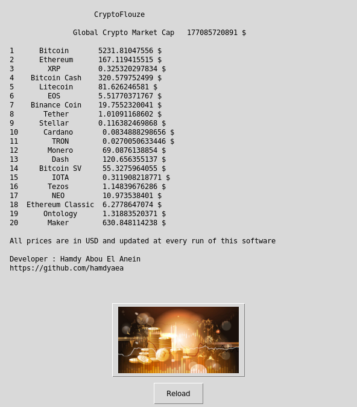

   

# CryptoFlouze



## What's this software ?  

This Python 3 software download and display the last prices of the top 20 cryptocurrencies on the market.
All the data are updated at every run.
The data is downloaded from : https://coinmarketcap.com/api/

You need to subscribe to have a free api key and put it at the line 45. (ttps://coinmarketcap.com/api/)


## What you need to make it work :  

You need to subscribe to have a free api key and put it at the line 45. 


https://coinmarketcap.com/api/ #apply-for-an-api-key 

Modify this line with your key :

Put the key between the " " without space on line 45.


The last version of Python 3.

you also need to have the easygui library for python 3:

At least the version 0.98

```sh
sudo python3 -m pip install --upgrade easygui 
```


## How to launch this software :  

```sh
python3 CryptoFlouze.py
```  

## Requirements :

If you miss a module, install it with the command pip install module-name. For example if you miss PIL you can install it with : sudo pip3 install pillow.

Your user must have read and write access on the current running 
directory.


## Developer - Author

Hamdy Abou El Anein

## Homepage

http://www.daylightlinux.ch 
